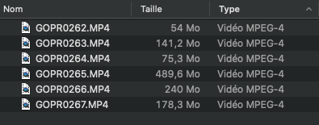
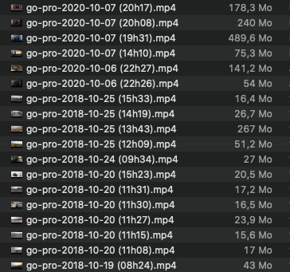

# Rename your GoPro files with jbang script
A simple [jbang](https://github.com/jbangdev/jbang) script to rename GoPro files

The script will rename your GoPro .MP4 files from :



To :



---
### Install [jbang](https://github.com/jbangdev/jbang)
You need to install `jbang` to run the script.

→ https://github.com/jbangdev/jbang#installation
___
### How to run the script ?
Put the file `rename-go-pro-files.java` in your GoPro videos repository and make sure that you have the rights to execute it :
```
sudo chmod 777 rename-go-pro-files.java
```

Now you can easilly run the script :
```
./rename-go-pro-files.java
```
